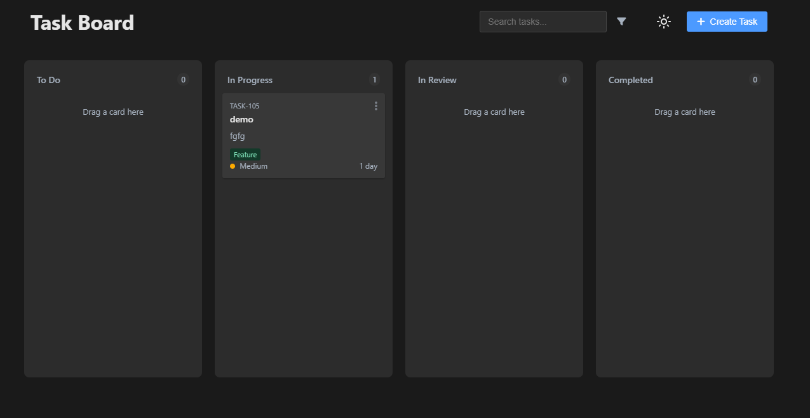

# Task Board - Interactive Kanban Board



## Overview

Task Board is a feature-rich, interactive Kanban board application designed to help individuals and teams organize tasks efficiently. Built with vanilla JavaScript, HTML, and CSS, this application offers a clean, intuitive interface for task management with advanced features like subtasks, due dates, and data persistence.

## Features

### Core Functionality
- **Drag-and-Drop Interface**: Easily move tasks between different status columns
- **Task Management**: Create, edit, and delete tasks with detailed information
- **Subtasks Support**: Break down complex tasks into manageable subtasks
- **Due Dates**: Set and track deadlines with visual indicators
- **Task History**: Track changes made to each task over time

### User Experience
- **Dark/Light Theme**: Toggle between themes with automatic preference saving
- **Responsive Design**: Works seamlessly on desktop and mobile devices
- **Toast Notifications**: Receive feedback on actions with non-intrusive notifications
- **Search & Filter**: Quickly find tasks based on various criteria

### Data Management
- **Local Storage**: All data persists between sessions using browser localStorage
- **Import/Export**: Share or backup your tasks using JSON or CSV formats

## Getting Started

### Prerequisites
- A modern web browser (Chrome, Firefox, Safari, Edge)
- No server-side dependencies required

### Installation
1. Clone the repository:
   ```
   git clone https://github.com/alexanderuk82/task-board-kanban.git
   ```
2. Open `index.html` in your browser

### Online Demo
Try the live demo: [Task Board Demo](https://task-board-manager.windsurf.build)

## Usage Guide

### Creating Tasks
1. Click the "Create Task" button in the header
2. Fill in the task details (title, description, priority, etc.)
3. Click "Save" to add the task to the board

### Managing Tasks
- **Move Tasks**: Drag and drop tasks between columns
- **Edit Tasks**: Click on a task to open the edit modal
- **Add Subtasks**: In the edit modal, use the subtask section to add smaller components
- **Track Progress**: Use the progress bar to visualize completion status

### Data Backup
1. Click the export/import button in the header
2. Choose "Export" to download your data in JSON or CSV format
3. Use "Import" to restore from a previous backup

## Technical Implementation

The application follows an object-oriented approach with a central `TaskManager` class that handles all task-related operations. Key technical aspects include:

- **MVC-like Architecture**: Separation of data management and UI rendering
- **Event Delegation**: Efficient event handling for dynamic elements
- **CSS Variables**: Theme switching using CSS custom properties
- **Responsive Design**: Flexbox and CSS Grid for layout adaptability

## Browser Compatibility

- Chrome 60+
- Firefox 60+
- Safari 12+
- Edge 79+

## License

This project is licensed under the MIT License - see the LICENSE file for details.

## Acknowledgments

- Icons provided by [Font Awesome](https://fontawesome.com/) and [Lucide](https://lucide.dev/)
- Inspiration from popular project management tools like Trello and Jira
